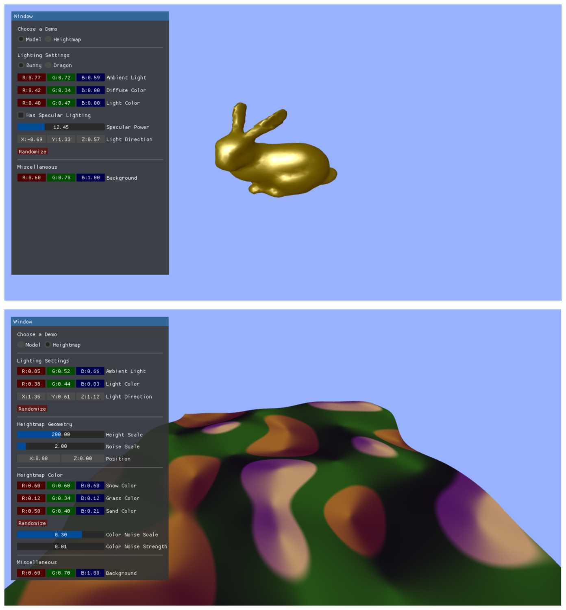
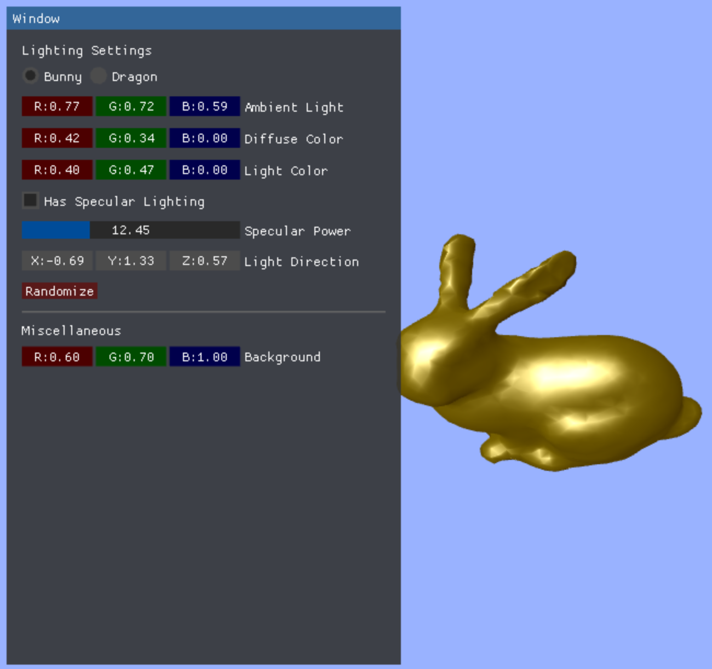
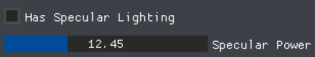
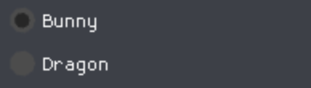
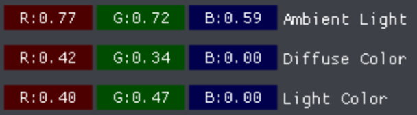
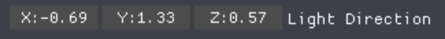
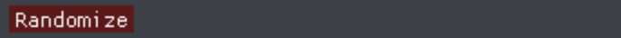
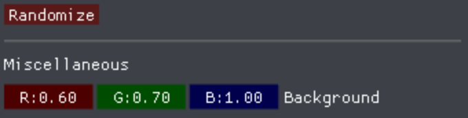

# pnp-gui

pnp-gui(plug n' play GUI) is a WebGL gui toolkit whose main goal is to be easy to use, bloat-free, and be easy to
integrate into any project. Impatient people probably want a demo right away,
and [here](https://github.com/Erkaman/pnp-gui#demo) it is.

pnp-gui takes much inspiration from the fantastic [imgui](https://github.com/ocornut/imgui)
project. Like imgui, it provides an Immediate Mode GUI toolkit. Also like imgui,
it aims to be as bloat-free as possible, and to be easy to integrate into
any project. Very little code needs to be written to create a simple GUI,
and a font comes pre-packaged with the library.

pnp-gui is mainly meant to be used by programmers who want to make a simple GUI
for debugging purposes, or who want a simple GUI that can be used
to tweak a couple of variables in their applications. Also, in the provided demo,
some possible use-cases of pnp-gui are shown.

However, do note that due to the simplicity of the toolkit, there are many drawbacks.
pnp-gui does not provide you with any way to do advanced widget and window layout.
More advanced GUI toolkits such as Swing and QT provides ways to create advanced
window layouts. However, in order to reduce complexity, the window layout
options of pnp-gui have been made very limited.

Another important thing to note is that pnp-gui does not provide any way of
creating beautiful interfaces that can be presented to the end user. You can
tweak a couple of colors and spacing constants here and there, but there is
no support at all for skinning the GUI. Again, we empathize that the toolkit
is mainly meant to be used by programmers who want a simple GUI for debugging
purposes.

[](https://www.npmjs.com/package/pnp-gui)


## Demo

A demo is given at this link:
http://erkaman.github.io/pnp-gui/

It should look like this:



First, note that the GUI in the demo is all rendered using WebGL, and no HTML is used at all. It is actually two demos in one, and the demo can be toggled with the upper radio button.
In the first demo, you can use the widgets of pnp-gui to change the lighting and color
settings of a simple model. In the second demo, you can use the widgets
of pnp-gui to modify the lighting, color and geometry of a simple heightmap. Note that you can move the
window by dragging and dropping.

And the source code of the demo can be found at `example/index.js`

See also [here](https://github.com/Erkaman/glsl-godrays#readme) for an example of an actual application using pnp-gui

## Tutorial

In this section, we give a tutorial that demonstrates how easy it is to use
the toolkit. First we give the source code of another simple demo:

```javascript
/* global requestAnimationFrame */

var bunny = require('bunny');
var mat4 = require('gl-mat4');
var vec3 = require('gl-vec3');
var Geometry = require('gl-geometry');
var glShader = require('gl-shader');
var normals = require('normals');
var glslify = require('glslify')
var createOrbitCamera = require('orbit-camera');
var shell = require("gl-now")();
var createGui = require("pnp-gui");
var cameraPosFromViewMatrix = require('gl-camera-pos-from-view-matrix');
var dragon = require('stanford-dragon/3');
var boundingBox = require('vertices-bounding-box');
var transform = require('geo-3d-transform-mat4');
var randomArray = require('random-array');

var demo1Shader, bunnyGeo, dragonGeo;

var camera = createOrbitCamera([0, -1000, 0], [0, 0, 0], [0, 1, 0]);

var mouseLeftDownPrev = false;

const RENDER_BUNNY = 0;
const RENDER_DRAGON = 1;

/*
 Variables that can be modified through the GUI.
 */

var bg = [0.6, 0.7, 1.0]; // clear color.

var demo1DiffuseColor = [0.42, 0.34, 0.0];
var demo1AmbientLight = [0.77, 0.72, 0.59];
var demo1LightColor = [0.40, 0.47, 0.0];
var demo1SunDir = [-0.69, 1.33, 0.57];
var demo1SpecularPower = {val: 12.45};
var demo1HasSpecular = {val: true};
var demo1RenderModel = {val: RENDER_BUNNY};

const demo1Vert = `
precision mediump float;

attribute vec3 aPosition;
attribute vec3 aNormal;

varying vec3 vNormal;
varying vec3 vPosition;

uniform mat4 uProjection;
uniform mat4 uView;

void main() {
  vNormal = aNormal;
  vPosition = aPosition;

  gl_Position = uProjection * uView * vec4(aPosition, 1.0);
}
`

const demo1Frag = `
precision mediump float;

varying vec3 vNormal;
varying vec3 vPosition;

uniform vec3 uDiffuseColor;
uniform vec3 uAmbientLight;
uniform vec3 uLightColor;
uniform vec3 uLightDir;
uniform vec3 uEyePos;
uniform mat4 uView;
uniform float uSpecularPower;
uniform float uHasSpecular;

void main() {
    vec3 n = vNormal;
    vec3 l = normalize(uLightDir);
    vec3 v = normalize(uEyePos - vPosition);

    vec3 ambient = uAmbientLight * uDiffuseColor;
    vec3 diffuse = uDiffuseColor * uLightColor * dot(n, l) ;
    vec3 specular = pow(clamp(dot(normalize(l+v),n),0.0,1.0)  , uSpecularPower) * vec3(1.0,1.0,1.0);

    gl_FragColor = vec4(ambient + diffuse + specular*uHasSpecular, 1.0);
}
`

// center geometry on (0,0,0)
function centerGeometry(geo, scale) {

    // Calculate the bounding box.
    var bb = boundingBox(geo.positions);

    // Translate the geometry center to the origin.
    var translate = [-0.5 * (bb[0][0] + bb[1][0]), -0.5 * (bb[0][1] + bb[1][1]), -0.5 * (bb[0][2] + bb[1][2])];
    var m = mat4.create();
    mat4.scale(m, m, [scale, scale, scale]);
    mat4.translate(m, m, translate);

    geo.positions = transform(geo.positions, m)
}

shell.on("gl-init", function () {
    var gl = shell.gl

    gl.enable(gl.DEPTH_TEST);
    gl.enable(gl.CULL_FACE);

    gui = new createGui(gl)
    gui.windowSizes = [360, 580];

    centerGeometry(bunny, 80.0);
    bunnyGeo = Geometry(gl)
        .attr('aPosition', bunny.positions)
        .attr('aNormal', normals.vertexNormals(bunny.cells, bunny.positions))
        .faces(bunny.cells)

    centerGeometry(dragon, 16.0);
    dragonGeo = Geometry(gl)
        .attr('aPosition', dragon.positions)
        .attr('aNormal', normals.vertexNormals(dragon.cells, dragon.positions))
        .faces(dragon.cells)

    demo1Shader = glShader(gl, demo1Vert, demo1Frag);
});

function demo1Randomize() {
    demo1DiffuseColor = randomArray(0, 1).oned(3);
    demo1AmbientLight = randomArray(0, 1).oned(3);
    demo1LightColor = randomArray(0, 1).oned(3);
    demo1SunDir = randomArray(-2, +2).oned(3);
    demo1SpecularPower.val = Math.round(randomArray(0, 40).oned(1)[0]);
}

shell.on("gl-render", function (t) {
    var gl = shell.gl
    var canvas = shell.canvas;

    gl.clearColor(bg[0], bg[1], bg[2], 1);
    gl.clear(gl.COLOR_BUFFER_BIT | gl.DEPTH_BUFFER_BIT);
    gl.viewport(0, 0, canvas.width, canvas.height);

    var model = mat4.create();
    var projection = mat4.create();
    var scratchMat = mat4.create();
    var view = camera.view(scratchMat);
    var scratchVec = vec3.create();

    mat4.perspective(projection, Math.PI / 2, canvas.width / canvas.height, 0.1, 10000.0);

    demo1Shader.bind();

    demo1Shader.uniforms.uView = view;
    demo1Shader.uniforms.uProjection = projection;
    demo1Shader.uniforms.uDiffuseColor = demo1DiffuseColor;
    demo1Shader.uniforms.uAmbientLight = demo1AmbientLight;
    demo1Shader.uniforms.uLightColor = demo1LightColor;
    demo1Shader.uniforms.uLightDir = demo1SunDir;
    demo1Shader.uniforms.uEyePos = cameraPosFromViewMatrix(scratchVec, view);
    demo1Shader.uniforms.uSpecularPower = demo1SpecularPower.val;
    demo1Shader.uniforms.uHasSpecular = demo1HasSpecular.val ? 1.0 : 0.0;

    if (demo1RenderModel.val == RENDER_BUNNY) {
        bunnyGeo.bind(demo1Shader);
        bunnyGeo.draw();
    } else if (demo1RenderModel.val == RENDER_DRAGON) {
        dragonGeo.bind(demo1Shader);
        dragonGeo.draw();
    }

    var pressed = shell.wasDown("mouse-left");
    var io = {
        mouseLeftDownCur: pressed,
        mouseLeftDownPrev: mouseLeftDownPrev,

        mousePositionCur: shell.mouse,
        mousePositionPrev: shell.prevMouse
    };
    mouseLeftDownPrev = pressed;

    gui.begin(io, "Window");


    gui.textLine("Lighting Settings");

    gui.radioButton("Bunny", demo1RenderModel, RENDER_BUNNY);
    gui.sameLine();
    gui.radioButton("Dragon", demo1RenderModel, RENDER_DRAGON);

    gui.draggerRgb("Ambient Light", demo1AmbientLight);
    gui.draggerRgb("Diffuse Color", demo1DiffuseColor);
    gui.draggerRgb("Light Color", demo1LightColor);

    gui.checkbox("Has Specular Lighting", demo1HasSpecular);
    if (demo1HasSpecular.val)
        gui.sliderFloat("Specular Power", demo1SpecularPower, 0, 40);

    gui.draggerFloat3("Light Direction", demo1SunDir, [-2, +2], ["X:", "Y:", "Z:"]);

    if (gui.button("Randomize")) {
        demo1Randomize();
    }

    gui.separator();

    gui.textLine("Miscellaneous");
    gui.draggerRgb("Background", bg);

    gui.end(gl, canvas.width, canvas.height);
});

shell.on("tick", function () {

    // if interacting with the GUI, do not let the mouse control the camera.
    if (gui.hasMouseFocus())
        return;

    if (shell.wasDown("mouse-left")) {
        var speed = 2.0;
        camera.rotate([(shell.mouseX / shell.width - 0.5) * speed, (shell.mouseY / shell.height - 0.5) * speed],
            [(shell.prevMouseX / shell.width - 0.5) * speed, (shell.prevMouseY / shell.height - 0.5) * speed])
    }
    if (shell.scroll[1]) {
        camera.zoom(shell.scroll[1] * 0.6);
    }
});
```

the above demo results in the following GUI:




Let us now go through the important parts of the above demo.
First of all, the code that creates the gui object:

```javascript
    gui = new createGui(gl)
    gui.windowSizes = [360, 580];
```

In the first line, we simply create the gui object. In the second line, we set the
window sizes of the GUI. As remarked in the Introduction, we do not provide any means of doing advanced
GUI layout. So if the window does not fit all widgets you place out,
you will have to solve this by setting the value of `gui.windowSizes` so that all widgets fit.
Note that you can tweak this value at any time, not just after creation.

After creating the gui object, we are now ready to use it. You need to first provide png-gui with IO-information:

```javascript
    var pressed = shell.wasDown("mouse-left");
    var io = {
        mouseLeftDownCur: pressed,
        mouseLeftDownPrev: mouseLeftDownPrev,

        mousePositionCur: shell.mouse,
        mousePositionPrev: shell.prevMouse
    };
    mouseLeftDownPrev = pressed;
```

before you can start placing out the widgets, you must provide the toolkit
with IO-information. Currently, the toolkit only needs the current mouse position,
the mouse position in the previous frame, whether the left mouse button is
down the current frame, and whether the left mouse button was down the previous frame.
And we put all information into a single `io` object. We then pass this
object to pnp-gui

```javascript
gui.begin(io, "Window");
```

where we specify the io-information, and the window title. After this method
has been called, we can start placing out GUI widgets:

```javascript
    gui.textLine("Lighting Settings");

    gui.radioButton("Bunny", demo1RenderModel, RENDER_BUNNY);
    gui.sameLine();
    gui.radioButton("Dragon", demo1RenderModel, RENDER_DRAGON);

    gui.draggerRgb("Ambient Light", demo1AmbientLight);
    gui.draggerRgb("Diffuse Color", demo1DiffuseColor);
    gui.draggerRgb("Light Color", demo1LightColor);

    gui.checkbox("Has Specular Lighting", demo1HasSpecular);
    if (demo1HasSpecular.val)
        gui.sliderFloat("Specular Power", demo1SpecularPower, 0, 40);

    gui.draggerFloat3("Light Direction", demo1SunDir, [-2, +2], ["X:", "Y:", "Z:"]);

    if (gui.button("Randomize")) {
        demo1Randomize();
    }


    gui.separator();

    gui.textLine("Miscellaneous");
    gui.draggerRgb("Background", bg);
```

Let us step by step go through the above. By calling

```javascript
gui.textLine("Lighting Settings");
```

we can simply write out a line of text.

Let us look at the next couple lines.
These lines renders two radio buttons that are used to choose the model that
is being rendered.

```javascript
    gui.radioButton("Bunny", demo1RenderModel, RENDER_BUNNY);
    gui.sameLine();
    gui.radioButton("Dragon", demo1RenderModel, RENDER_DRAGON);
```

the above lines results in:




Note here that `demo1RenderModel` is defined as

```
var demo1RenderModel = {val: RENDER_BUNNY};
```

Since `demo1RenderModel.val` has value `RENDER_BUNNY`, and because first radio button
also has the value `RENDER_BUNNY`, the first radio button is rendered as filled in.
However, if the user clicks on the second radio button, `demo1RenderModel.val`
will, by the toolkit, be modified to `RENDER_DRAGON`, and thus the second
radio button is rendered as filled in.

It is also easy to add another radio button. Just add another line

```javascript
    gui.radioButton("Cat", demo1RenderModel, RENDER_CAT);
```

and, if `RENDER_CAT` has a value distinct from `RENDER_BUNNY` and `RENDER_BUNNY`, it will work.

Finally, note that between the two calls to `radioButton`, we are calling
`sameLine`. This makes it so that the two radio buttons are put on the same line. Otherwise, they would have been placed on different lines. Like this:



`sameLine` is a very flexible function, and can be used with any two widgets!

Let us now look at the next three lines of the GUI. Here we are using three `draggerRgb` widgets to control the
ambient light, diffuse color, and light color of the model:

```javascript
    gui.draggerRgb("Ambient Light", demo1AmbientLight);
    gui.draggerRgb("Diffuse Color", demo1DiffuseColor);
    gui.draggerRgb("Light Color", demo1LightColor);
```

the above results in:



`draggerRgb` is a useful widget that can be used to let the user input a color. The input parameters to the function `draggerRgb` is
a label string, and an array that contains the color being modified by the widget. Note, for instance, that
`demo1DiffuseColor` is defined as

```
var demo1DiffuseColor = [0.42, 0.34, 0.0];
```

and this array will be modified by the toolkit when the user manipulates the first of the three `draggerRgb` widgets.

Let us now look at the next part of the GUI. Next, comes a checkbox that controls whether the model should have
specular lighting. If it should have specular lighting, then we also render a slider widget that controls the specular power.
This is all rendered with the following code:

```javascript
    gui.checkbox("Has Specular Lighting", demo1HasSpecular);
    if (demo1HasSpecular.val)
        gui.sliderFloat("Specular Power", demo1SpecularPower, 0, 40);
```

the above results in this:


and especially note that if the checkbox is not checked, then the below slider widget is not rendered!

The `checkbox` widget is a simple widget. If the user checks the checkbox, then `demo1SpecularPower.val` is `true`, othewise, it is `false`. The next couple of lines are however quite interesting

```javascript
if (demo1HasSpecular.val)
        gui.sliderFloat("Specular Power", demo1SpecularPower, 0, 40);
```

this shows that in order to remove a widget in pnp-gui, all we have to do is not render the widget at all. And that's it.  So if `demo1HasSpecular.val`, then render widget, otherwise do not render it at all.

The `sliderFloat` is also a relatively simple widget. `demo1SpecularPower` is defined as

```javascript
var demo1SpecularPower = {val: 12.45};
```

and if the user manipulates `sliderFloat`, then `demo1SpecularPower.val` is modified. However, since the third and fourth parameters are `0` and `40`, the value is restricted to be in the range `[0,40]`. Also, if you want a slider widget for integer values, simply use `sliderInt`.

Now let us look at the next line of code in the GUI. This is a widget that allow you to change the light direction
of the light that is illuminating the model:

```javascript
    gui.draggerFloat3("Light Direction", demo1SunDir, [-2, +2], ["X:", "Y:", "Z:"]);
```

the code results in




`draggerFloat3` is a very flexible widget. You can use it when you want to set three values in a single widget.
As can be observed it is really a single widget composed of three subwidgets.
And as has probably already been guessed, `demo1SunDir` is simply an array of three:

```
var demo1SunDir = [-0.69, 1.33, 0.57];
```

The argument `[-2, +2]`  specifies that the min and max values of all the three subwidgets is `-2` and `+2`. However,
you can have even more fine-grained control of the subwidgets. If you instead pass `[[0,1], [-2,1], [-1,0] ` you
can specify that the first subwidget specifies values in range `[0,1]`, the second one in range `[-2,1]` and the third one
in range `[-1,0]`.

Optionally, you can also specify labels for all the subwidgets. The argument `["X:", "Y:", "Z:"]` specifies a label for each
of the three subwidgets.

Finally, in addition to `draggerFloat3`, there are also the widgets `draggerFloat1`, `draggerFloat2` and `draggerFloat4`. But they work exactly like `draggerFloat3`, except that they handle arrays of size 1, 2, 4.

Now let us look at the next lines of code in the Gui. Next, we have a button that randomizes all the values in the above widgets if you press it:

```javascript
    if (gui.button("Randomize")) {
        demo1Randomize();
    }
```

it looks like this:




As can be seen, `button` is very easy to use; if the button was pressed the current frame, return `true`, otherwise, return false `false`.

Let us go to the next line in the GUI. It is a widget that places out a separator:

```
    gui.separator();
```

it is the gray line in the following image:





As can be observed, the separator can be used to introduce logical groupings into a GUI.

the remainder of the GUI code looks like this:

```javascript
    gui.textLine("Miscellaneous");
    gui.draggerRgb("Background", bg);
    gui.end(gl, canvas.width, canvas.height);
```

the first two lines should already be perfectly understandable by now. So let us skip to the third line. In order to use pnp-gui, you
must do the following every single frame:

```
    gui.begin(io, "Window");

    // place out widgets here....

    gui.end(gl, canvas.width, canvas.height);
```

so you MUST place out the widgets every single frame. It will not work if you only place them out the first frame.
This is because pnp-gui does, as is stated in the FAQ, not save any retained state. It will not remember where you
placed out the widgets for you, instead the GUI is created on the fly every single frame. Therefore, you must specify
the widgets every single frame.

Now the tutorial is almost over. The last thing we would like to cover are these lines:

```javascript
shell.on("tick", function () {

    // if interacting with the GUI, do not let the mouse control the camera.
    if (gui.hasMouseFocus())
        return;

    if (shell.wasDown("mouse-left")) {
        var speed = 2.0;
        camera.rotate([(shell.mouseX / shell.width - 0.5) * speed, (shell.mouseY / shell.height - 0.5) * speed],
            [(shell.prevMouseX / shell.width - 0.5) * speed, (shell.prevMouseY / shell.height - 0.5) * speed])
    }
    if (shell.scroll[1]) {
        camera.zoom(shell.scroll[1] * 0.6);
    }
});
```

these lines do the following: if the user is not interacting with the GUI, we let the user manipulate the camera using the
mouse. However, if the user is interacting with the GUI, then `gui.hasMouseFocus()` will return true. If the user
is using the GUI, we often do not want the user to be able to interact with the 3D view as well, so we do not allow that if `gui.hasMouseFocus()` returns `true`.

So, by using `gui.hasMouseFocus()`, we can ensure that the user does not use the GUI and the 3D application at the same time.

## FAQ

<b>What is an Immediate Mode GUI?</b>

This basically means that there is no retained state in the GUI; that is to say,
there are no objects that are used to store the widgets of the GUI. Instead the
GUI is being created on the fly every single frame. While this may seem unnatural
to people who have not used such a GUI before, this kind of design actually results in
a GUI that is very intuitive to use for programmers. If you wish to see this in action, please
see the [tutorial](https://github.com/Erkaman/pnp-gui#tutorial)

<b>Does pnp-gui support text input?</b>

This is not yet supported.

<b>Is it possible to change the default font?</b>

As was stated in the introduction, png-gui does not, by design, offer very many features when it comes to changing the visual appearance.
Therefore, this feature is not supported.

If you anyways wish to change the font, you will have to dig into the source code of the project. The font is stored as a font-atlas `.png` packed using `ndpack-image` and as a `.json` file of character info, and both files were generated by [this](https://github.com/Erkaman/small_proggy_font_creator) C program.

<b>Can you render unicode text strings with pnp-gui?</b>

Currently, the toolkit can only render text strings where the characters are in the range `0x20`-`0x7E` in the ASCII table. But for rendering English text, you do not need any other characters. If you use any other character than these, the result is undefined.

<b>Can you create multiple windows?</b>

Not yet supported.

<b>Can you change the font size?</b>

Not yet supported.

<b>To what degree can you customize the appearance of the GUI?</b>

This toolkit is not really meant to be used to create beautiful GUIs, but there are certain visual aspects that you can customize. There are many constants that control the spacing and colors of the GUI. To, for instance, change the transparency of the window, you simply do this:

```
    gui.windowAlpha = 0.5;
```

The rest of the constants that can be customized are all listed in the function `_setupDefaultSettings` in `index.js`. Note that these constants can be customized at ANY time; you do not have to do all customization at the initialization of the GUI.


## API

Note that this section should be treated as a quick reference, and if you want more details, you should read the [tutorial](https://github.com/Erkaman/pnp-gui#tutorial)


### `var gui = new require("pnp-gui")(gl);`

create the GUI.

* `gl` your WebGL context

### `gui.begin(io, windowTitle)`

Creates a window where you can place out your widgets. Should always be called before you place out your widgets.

* `io` an object that contains the properties
 * `mouseLeftDownCur` whether the left mouse button is down for the current frame.
 * `mouseLeftDownPrev` whether the left mouse button was down for the previous frame.
 * `mousePositionCur` the mouse position of the current frame
 * `mousePositionPrev`  the mouse position of the previous frame
* `windowTitle` the title of the window.

### `gui.end(gl, canvasWidth, canvasHeight)`

Should be called once you have placed out your widgets.

* `gl` your WebGL context
* `canvasWidth` the width of the canvas.
* `canvasHeight` the height of the canvas.

### `gui.hasMouseFocus()`

Returns `true` if the user is interacting with the GUI in some manner. Else `false`.

### `gui.button(str)`

Places a button. Returns `true` if the button is clicked, else `false`

* `str` the text string in the button.

### `gui.sameLine()`

The next widget is placed on the same line as the previous widget, if this method is called between them.

### `gui.sliderFloat(labelStr, value, min, max)`

A slider that can be used to set a floating point value.

* `labelStr` The right label of the slider.
* `value` the value manipulated by this widget. Should be on the form `{val: v}`
* `min` the minimum value of the slider.
* `max` the maximum value of the slider.

### `gui.sliderInt(labelStr, value, min, max)`

Same as `sliderFloat`, expect the values are rounded to integers.

### `gui.draggerFloat3(labelStr, value, minMaxValues, subLabels)`

Places out a list of three dragger subwidgets. This widget can be used to manipulate an array of length 3 with a single widget.

* `labelStr` The right label of the widget.
* `value` the array that is manipulated by this widget. Should be an array of length 3.
* `minMaxValues` if an array on the form `[min,max]`, then this parameter specifies the min and max values of ALL the three subwidgets. However, if it is an array on the form `[ [min1,max1], [min2,max2], [min3,max3] ]`, then `[min1,max1]` is the min and max values of the first subwidget, and so on.
* `subLabels` specifies the labels of the subwidgets. Defaults to an array of empty strings.

### `gui.draggerFloat4(labelStr, value, minMaxValues, subLabels)`

Same as `draggerFloat3`, except it handles arrays of length 4.

### `gui.draggerFloat2(labelStr, value, minMaxValues, subLabels)`

Same as `draggerFloat3`, except it handles arrays of length 2.

### `gui.draggerFloat1(labelStr, value, minMaxValues, subLabels)`

Same as `draggerFloat3`, except it handles arrays of length 1.

### `gui.draggerRgb(labelStr, value)`

Basically a specialized version of `draggerFloat3` that allows you to manipulate RGB-values(array of length 3), and `minMaxValues` is set to `[0,1]`.

### `gui.radioButton(labelStr, value, id)`

Places out a single radio button. For more detailed usage, see the [tutorial](https://github.com/Erkaman/pnp-gui#tutorial)

* `labelStr` The right label of the radio button.
* `value`. The value manipulated by this widget. Should be on the form `{val: v}`.
* `id` the id of this button. If `value.val == id`, then this radio button is the chosen radio button, in a group of radio buttons.

### `gui.checkBox(labelStr, value)`

Places out a checkbox.

* `labelStr` The right label of the checkbox.
* `value`. The value manipulated by this widget. Should be on the form `{val: v}`. If `value.val` is true, then the checkbox is checked, otherwise it is not.


### `gui.separator()`

Places out a separator, that can be used to create logical groupings in a GUI.

### `gui.textLine(str)`

Places out a single line of text.

* `str` the string this widget renders.
